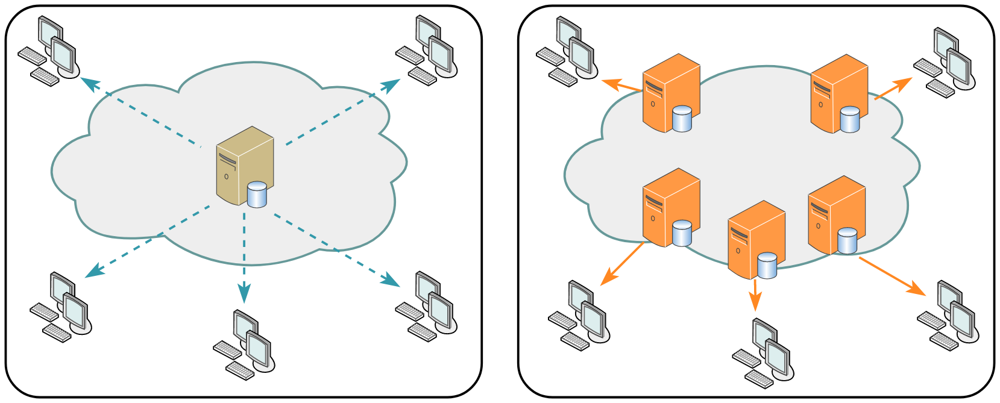

# AWS CloudFront

## Теория

AWS CloudFront — это CDN (Content Delivery Network) облачного провайдера AWS. Он позволяет ускорить доступ к файлам через Интернет. Работает с помощью кеширования файлов на серверах в точках присутствия (Point of Presence — POP) которые которые расположены близко к клиентам.

<div style="text-align:center">

</div>

Этот сервис не привязан к конкретному региону и всегда базируется в первом по счету регионе: `us-east-1`.

Хороший CDN имеет много точек присутствия (Point of Presence, POP).

Хороший CDN имеет хорошие магистральные каналы связи.

Примеры CDN:
* YouTube использует Google Global Cache со специализированными серверами
* Netflix развивает свою сеть CDN со специализированными серверами
* Akamai
* Cloudflare
* Fastly
* AWS Cloudfront

## Подготовительные шаги

1. Создайте в текстовом редакторе файл:

   ```
   <html>
   <body>
   <video width="1920" height="1080" controls>
       <source src="clip.mp4" type="video/mp4">
       Your browser does not support the video tag.
   </video>
   </body>
   </html>
   ```

   и сохраните его в файле `index.html`.

2. Откройте [YouTube](https://youtube.com/) и найдите ролик длительностью от 10 до 20 минут.


## Практика

1. Войдите в AWS Console с логином и паролем предоставленным преподавателем.

2. Перейдите в регион `South America (São Paulo) sa-east-1`.

3. Откройте командную строку `CloudShell` (кнопка в левом нижнем углу веб-консоли).

4. Создайте S3 бакет с именем `<группа>-<фамилия>`:

   ```cmd
   aws s3 mb s3://<группа>-<фамилия>/ --region sa-east-1
   ```

5. Убедитесь, что бакет создан, проверив их список:

   ```cmd
   aws s3 ls
   ```

6. Включите режим работы веб-сайта:

   ```cmd
   aws s3 website s3://<группа>-<фамилия>/ --index index.html
   ```

7. Скачайте ролик:

   ```cmd
   pip3 install yt-dlp
   yt-dlp -f 137 -o "clip.mp4" "<ссылка на ролик>"
   ```

8. Загрузите ролик в бакет:

   ```cmd
   aws s3 cp clip.mp4 s3://<группа>-<фамилия>/
   ```

9. Закройте CloudShell и вернитесь в веб-консоль.

10. Откройте сервис S3. Откройте бакет в веб-консоли и загрузите `index.html` в бакет.

11. Включите публичный доступ: 

    * на вкладке `Permissions`, в разделе `Block public access`, нажать `Edit`, убрать галочку и сохранить изменения.
    * на вкладке `Permissions`, в разделе `Object Ownership`, нажать `Edit`, разрешить использование ACL и сохранить изменения.
    * на вкладке `Objects`, выделите все файлы, `Actions`, `Make public using ACL`, `Make public`

12. Откройте сервис `CloudFront` создайте новый Distribution:

    * Выбрать Origin domain
    * В разделе Web Application Firewall (WAF) выберите "Do not enable…"
    * Добавить дополнительное имя (CNAME) вида `<имя группы>-<фамилия студента>`
    * Выбрать SSL-сертификат `*.kit-imi.info`
    * Default root object - `index.html`

    После создания скопируйте доменное имя Distribution.

13. Откройте сервис Route53, раздел Hosted zones и зону `kit-imi.info`. Cоздайте доменное имя типа CNAME которое указывает на доменное имя вашего Cloudfront Distribution (без `https://`). В качестве доменного имени впишите `<имя группы>-<фамилия студента>`.

14. Откройте `Git Bash` и выполните команду:

    ```
    curl -v <URL файла clip.mp4 с S3> -o clip.mp4
    ```

    Обратите внимание на скорость скачивания.

    Сделайте скриншот результата.

15. Откройте новое окно `Git Bash`. Несколько раз выполните команду (используйте `http`-вариант ссылки)

    ```
    curl -v <URL файла clip.mp4 с CloudFront> -o clip.mp4
    ```

    Когда заголовок `X-Cache` изменится на `Hit from cloudfront` остановите попытки.

    Сделайте скриншот результата и сравните скорость со скоростью скачивания с S3.
