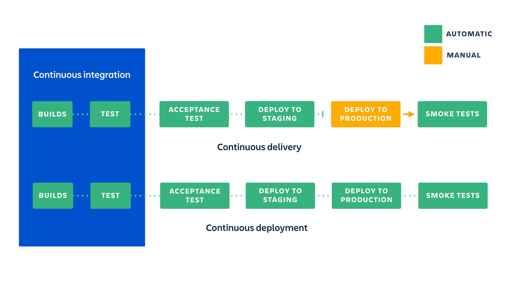

# CI/CD

CI/CD — это набор методик в промышленной разработке ПО при котором необходимо внедрять автоматизированное тестирование и развертывание кода.

CI/CD позволяет ускорить внедрение нового функционала в продукты компании.



Программные средства для CI/CD:
* Self-hosted (on premise)
  * [Hudson](https://ru.wikipedia.org/wiki/Hudson) — устарел, не применяется
  * [Jenkins](https://www.jenkins.io/)
  * [JetBrains TeamCity](https://www.jetbrains.com/teamcity/)
  * и другие
* Облачные решения
  * [Travis CI](https://www.travis-ci.com/)
  * [Circle CI](https://circleci.com/)
  * [GitHub Actions](https://docs.github.com/actions)
  * [GitLab CI/CD](https://docs.gitlab.com/ee/ci/)
  * [Bitbucket CI/CD](https://www.atlassian.com/software/bitbucket)
  * и другие

GitHub Actions:
1. Workflows
2. Jobs
3. Steps
   * Run — команда для выполнения в оболочке
   * Uses — готовая команда из [Маркетплейса](https://github.com/marketplace?type=actions)

Во время выполнения CI/CD доступны [переменные, из разных контекстов](https://docs.github.com/en/actions/learn-github-actions/contexts).

## Практика

1. Создать каталог проекта и открыть его в VS Code.

2. Добавить `app.py`.

3. Добавить `test_app.py`.

4. Добавить `.github/workflows/cicd.yml`.

5. Добавить `.gitignore`.

6. Проверить работу проекта локально:
   ```cmd
   python -m venv venv
   venv\scripts\activate.bat
   pip install flask pytest
   pytest
   flask run
   ```

7. Создать репозиторий в папке проекта:
   ```cmd
   git init
   ```

8. Создать репозиторий на GitHub.

9. Привязать локальный репозиторий к репозиторию в GitHub:
   ```cmd
   git remote add origin <ссылка на облачный репозиторий>
   ```

10. Дать название главной ветке локального репозитория:
    ```cmd
    git branch -M main
    ```

11. Проверить имя и email разработчика, при необходимости исправить их:
    ```cmd
    git config --list
    git config --local user.name "Имя разработчика"
    git config --local user.email "Email разработчика"
    ```

12. Закоммитить изменения и протолкнуть их в GitHub:
    ```cmd
    git add .
    git commit -m <сообщение>
    ```

13. Проверить пользователя в диспетчере учетных данных. Если не ваш тогда - удалить его.

14. Отправить коммит на сервер с указанием как назвать главную ветку в удаленном репозитории:

    ```cmd
    git push -u origin main
    ```

15. Добавить Dockerfile.

16. Добавить описание задания (Job) для сборки и публикации Docker-образа в `.github/workflows/cicd.yml`.

17. Сделать коммит и убедиться, что происходит сборка образа контейнера:
    ```cmd
    git add .
    git commit -m <сообщение>
    git push
    ```

18. Создать ssh-ключ.

19. Запустить в AWS EC2 инстанс — сервер.

20. Подключиться к серверу и Установить в нем Docker.

21. Добавить своего пользователя в группу docker:
    ```cmd
    sudo usermod -a -G docker ubuntu
    ```

22. Создать на сервере docker-compose.yaml для запуска нашего образа.

23. Добавить адрес сервера, имя пользователя и закрытый ключ SSH в секреты в настройках репозитория.

24. Добавить описание задания для запуска docker compose на сервере по SSH.

Документация:
* https://docs.github.com/en/actions/publishing-packages/publishing-docker-images#publishing-images-to-github-packages
* https://github.com/marketplace/actions/ssh-remote-commands


**app.py**:
```python
from flask import Flask


app = Flask(__name__)


@app.route("/")
def index_page():
    return "Hello, World!"
```

**test_app.py**:
```python
import pytest
from app import app as app


@pytest.fixture
def webapp():
    app.config['TESTING'] = True
    yield app


@pytest.fixture()
def client(webapp):
    return webapp.test_client()


def test_index_page(client):
    res = client.get('/')
    assert res.status_code == 200
    assert 'Hello, World' in res.text
```

**.github/workflows/cicd.yml**:
```yaml
name: Пример непрерывной интеграции
on: [push]
jobs:
  testing:
    runs-on: ubuntu-latest
    steps:
      - name: Checkout
        uses: actions/checkout@v4

      - name: Setup Python
        uses: actions/setup-python@v5
        with:
          python-version: '3.11'

      - name: Install dependencies
        run: pip install flask pytest

      - name: Testing
        run: python -m pytest
```

**.gitignore**:
```
venv/
*.pyc
```

**Dockerfile**:
```Dockerfile
FROM python:3.11-slim
WORKDIR /web
COPY . .
EXPOSE 8000
RUN pip install flask gunicorn
CMD gunicorn -b 0.0.0.0 app:app
```

Описание задания для сборки и публикации образа Docker-контейнера:
```yaml
  build-publish:
    runs-on: ubuntu-latest
    needs: testing
    permissions:
      contents: read
      packages: write
    steps:
      - name: Checkout
        uses: actions/checkout@v4

      - name: Login to GitHub Container Registry
        uses: docker/login-action@v3
        with:
          registry: ghcr.io
          username: ${{ github.actor }}
          password: ${{ secrets.GITHUB_TOKEN }}

      - name: Extract metadata (tags, labels) for Docker
        id: meta
        uses: docker/metadata-action@v5
        with:
          images: ghcr.io/${{ github.repository }}

      - name: Build and push
        uses: docker/build-push-action@v5
        with:
          context: .
          push: true
          tags: ${{ steps.meta.outputs.tags }}
          labels: ${{ steps.meta.outputs.labels }}
```

Описание задания для запуска по SSH команды на удаленном сервере:
```yaml
  restart-docker-compose:
    runs-on: ubuntu-latest
    needs: build-deploy
    steps:
      - name: Run remote script with SSH
        uses: appleboy/ssh-action@v1.0.3
        with:
          host: ${{ secrets.HOST }}
          username: ${{ secrets.USERNAME }}
          key: ${{ secrets.KEY }}
          script: |
            cd $HOME
            docker compose down
            docker pull ghcr.io/${{ github.repository }}:main
            docker compose up -d
```

**docker-compose.yml**:
```yaml
services:
  app:
    image: ghcr.io/<пользователь GitHub>/<Репозиторий GitHub>:main
    restart: always
    ports:
      - 80:8000
```
