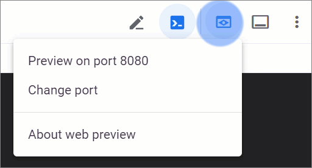

# Google Cloud Run

Cloud Run — это облачный сервис в GCP, который выполняет программный код упакованный в Docker-контейнер.

Cloud Run тесно интегрируется с другими сервисами GCP:
* Artefact Registry — реестр образов для Docker-контейнеров.
* Cloud Build — сервис для настройки пайплайнов CI/CD с возможностью сборки образов Docker-контейнеров.

## Задание 1

**Цель:** познакомиться с сервисом Cloud Run.

**План работы:**
* Загрузить на временный облачный сервер файлы с исходным кодом приложения.
* Проверить их работоспособность.
* Создать веб-приложение (сервис) в Cloud Run для обслуживания запросов пользователей.

**Ход работы:**

1. Войдите в [https://console.cloud.google.com](https://console.cloud.google.com) (далее консоль GCP) с помощью своего Google-аккаунта. При входе в первый раз GCP создаст вам учетную запись. При этом нужно будет выбрать произвольную страну.

2. Убедитесь, что преподаватель знает ваш Google-аккаунт и пригласил вас в свой проект (далее будем обращаться к нему IMI-SVFU). Откройте почту Gmail, найдите приглашение и примите его.

3. В консоли GCP выберите проект IMI-SVFU.

4. Откройте Google Cloud Shell:
    

5. Просмотрите список доступных учетных записей:
   ```cmd
   gcloud auth list
   ```

6. Выберите свою учетную запись:
   ```cmd
   gcloud config set account <Ваш Google-аккаунт>
   ```

7. Просмотрите список доступных проектов:
   ```cmd
   gcloud config list project
   ```

8. Выберите проект IMI-SVFU в Google Cloud Shell:
   ```cmd
   gcloud config set project imi-svfu
   ```

9. Создайте каталог для файлов проекта:
   ```cmd
   mkdir ~/helloworld-python
   ```

10. Перейдите в каталог для файлов проекта:
    ```cmd
    cd ~/helloworld-python
    ```

11. Создайте файлы с исходным кодом:
    ```cmd
    touch main.py requirements.txt Procfile
    ```

12. Откройте файлы в редакторе и вставьте исходный код (текст файлов прилагается ниже):
    ```cmd
    cloudshell edit main.py
    cloudshell edit requirements.txt
    cloudshell edit Procfile
    ```

13. Создайте виртуальное окружение:
    ```cmd
    virtualenv venv
    ```

14. Активируйте виртуальное окружение:
    ```cmd
    source venv/bin/activate
    ```

15. Установите в виртуальное окружение необходимые библиотеки:
    ```cmd
    pip install -r requirements.txt
    ```

16. Запустите приложение в режиме разработки:
    ```cmd
    python main.py
    ```

17. Откройте превью в браузере и убедитесь, что код работает (должно появиться сообщение "Hello World!"):
    

18. Остановите интерпретатор Python нажав клавишу Ctrl+C

19. Деактивируйте виртуальное окружение:
    ```cmd
    deactivate
    ```

20. Удалите виртуальное окружение:
    ```cmd
    rm -r venv/
    ```

21. Выберите регион для развертывания:\
    ```cmd
    REGION=europe-north1
    ```

22. Запустите развертывание:
    ```cmd
    gcloud run deploy <ваша фамилия> --source . --platform managed --region $REGION --allow-unauthenticated
    ```

23. Найдите в консоли GCP сервис Cloud Run, найдите свой сервис в списке.
24. Изучите возможности работы с веб-приложениями (сервисами) в интерфейс консоли GCP.
25. Найдите URL своего сервиса, откройте его в браузере и проверьте что он работает.

**main.py:**
```python
from flask import Flask, request

app = Flask(__name__)


@app.get("/")
def hello():
    """Return a friendly HTTP greeting."""
    who = request.args.get("who", default="World")
    return f"Hello {who}!\n"


if __name__ == "__main__":
    # Development only: run "python main.py" and open http://localhost:8080
    # When deploying to Cloud Run, a production-grade WSGI HTTP server,
    # such as Gunicorn, will serve the app.
    app.run(host="localhost", port=8080, debug=True)
```

**requirements.txt:**
```
# https://pypi.org/project/flask
Flask==3.0.2

# https://pypi.org/project/gunicorn
gunicorn==21.2.0
```

**Procfile:**
```
web: gunicorn --bind :$PORT --workers 1 --threads 8 --timeout 0 main:app
```

## Задание 2

**Цель:** научиться настраивать развертывание в Cloud Run в качестве этапа пайплайна Cloud Build.

**План работы:**
* Загрузить на временный облачный сервер файлы с исходным кодом приложения.
* Создать репозиторий в GitHub.
* Настроить развертывание сервиса в Cloud Run при коммите в GitHub-репозиторий.
* Внести изменения в исходный код и проверить автоматическое развертывание.

**Ход работы:**
1. Откройте Google Cloud Shell:
    

2. Авторизуйте доступ из Google Cloud Shell:
   ```cmd
   gcloud config set account <Ваш Google-аккаунт>
   ```

3. Выберите проект в Google Cloud Shell:
   ```cmd
   gcloud config set project imi-svfu
   ```

4. Настройте необходимые в будущем переменные окружения:
   ```cmd
   REGION=europe-north1
   PROJECT_ID=imi-svfu
   PROJECT_NUMBER=$(gcloud projects describe $PROJECT_ID --format='value(projectNumber)')
   ```

5. Создайте каталог для файлов проекта:
   ```cmd
   mkdir ~/video-describer-job
   ```

6. Перейдите в только что созданный каталог:
   ```cmd
   cd $_
   ```

7. Создайте файлы исходного кода приложения:
   ```cmd
   mkdir views
   touch package.json app.js Dockerfile views/index.pug
   ```

8. Откройте файлы в редакторе и вставьте исходный код (текст файлов прилагается ниже):
   ```cmd
   cloudshell edit package.json
   cloudshell edit app.js
   cloudshell edit Dockerfile
   cloudshell edit views/index.pug
   ```

9. Установите библиотеки Node.js:
   ```cmd
   npm install
   ```

10. Запустите приложение в режиме разработки:
    ```cmd
    npm run start
    ```

11. Откройте превью приложения (оно пока содержит ошибки, поэтому не сохраняет изменения)

12. Нажмите в Cloud Shell клавишу Ctrl+C чтобы прервать работу приложения

13. Укажите имя разработчика для сохранения в метаданных коммитов:
    ```cmd
    git config --global user.name "<имя разработчика>"
    ```

14. Укажите email разработчика для сохранения в метаданных коммитов:
    ```cmd
    git config --global user.email "<почта разработчика>"
    ```

15. Выберите способ аутентификации Git с помощью логина и пароля:
    ```cmd
    git config --global credential.helper cache
    ```

16. Создайте локальный репозиторий Git и подготовьте его к работе:
    ```cmd
    git init
    ```

17. Переименуйте текущую ветку Git в main:
    ```cmd
    git branch -M main
    ```

18. Добавьте каталог node_modules в список игнорируемых в Git:
    ```cmd
    echo node_modules/ >> .gitignore
    ```

19. Добавьте изменения в текущем каталоге в индекс для коммита (stage):
    ```cmd
    git add .
    ```

20. Сохраните изменения в коммите:
    ```cmd
    git commit -m "Initial commit"
    ```

21. Создайте новый репозиторий в GitHub и привяжите HTTPS-ссылку к репозиторию:
    ```cmd
    git remote add origin <https-ссылка на репозиторий>
    ```

22. Создайте персональный токен доступа (classic) для GitHub по [инструкции](https://docs.github.com/en/authentication/keeping-your-account-and-data-secure/managing-your-personal-access-tokens#creating-a-personal-access-token-classic) (с правом доступа к репозиториям) и используйте его в дальнейшем как пароль для git в командной строке.

23. Отправьте изменения в центральный репозиторий (используйте имя пользователя в GitHub и ранее созданный персональный токен доступа):
    ```cmd
    git push -u origin main
    ```

24. Откройте в консоли GCP сервис Cloud Run.

25. Нажмите кнопку "DEPLOY CONTAINER → SERVICE" для начала создания сервиса.

26. Выберите вариант "Continuously deploy from a repository" с логотипом GitHub. Нажмите кнопку "SET UP WITH CLOUD BUILD".

27. При необходимости разрешите доступ Cloud Build к GitHub и выберите созданный ранее репозиторий. Нажмите кнопку "NEXT".

28. Выберите тип сборки с помощью Dockerfile. Нажмите кнопку "SAVE".

29. Введите в качестве имени сервиса свою группу и фамилию.

30. Выберите регион `europe-north1`.

31. Выберите вариант аутентификации пользователей "Allow unauthenticated invocations".

32. Оставьте остальные изменения без изменений и нажмите кнопку "CREATE".

33. Откройте в браузере URL сервиса и проверьте что сервис отображает сообщение "Hello World!"

34. Измените сообщение в app.js

35. Добавьте изменения в текущем каталоге в индекс для коммита (stage):
    ```cmd
    git add .
    ```

36. Сохраните изменения в коммите:
    ```cmd
    git commit -m "Second commit"
    ```

37. Отправьте изменения в центральный репозиторий:
    ```cmd
    git push
    ```

38. Откройте в консоли GCP сервис Cloud Build и следите за процессом сборки и публикации новой версии

39. Вернитесь сервис Cloud Run, откройте свой сервис и проверьте что трафик теперь обслуживается новой версией кода.

40. Проверьте что сообщение в браузере по URL сервиса изменилось.

**app.js**:
```javascript
const express = require("express");


const app = express();
app.set('view engine', 'pug')


app.get("/", async (_req, res) => {
   res.render('index', {message: "Hello World!"})
});


const port = parseInt(process.env.PORT) || 8080;
app.listen(port, async () => {
   console.log(`Listening on port ${port}`);
});
```

**package.json**:
```json
{
 "name": "demo",
 "version": "1.0.0",
 "main": "app.js",
 "scripts": {
   "start": "node app.js"
 },
 "license": "ISC",
 "dependencies": {
   "express": "^5.1",
   "pug": "^3.0"
 }
}
```

**views/index.pug**:
```pug
html
  body
    h1= message
```

**Dockerfile**
```Dockerfile
FROM node:lts
COPY . .
RUN npm ci
EXPOSE 8080
CMD npm run start
```