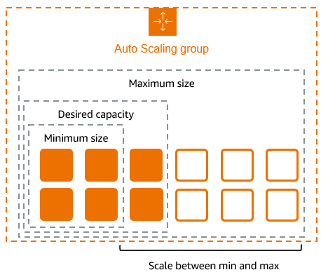

# Лаб. работа 4 — AWS EC2 Auto Scaling

## Теория

**Launch Template** — шаблон создания инстансов EC2. Заменяет **Launch Configurations**. Задает параметры:

* AMI (Amazon Machine Image) — образ для создания дисков инстансов EC2
* тип инстансов EC2 и ключ для подключения по SSH
* параметры сети (подсеть, группа безопасности)
* параметры дисков
* остальные параметры инстансов EC2

**Load Balancer** — балансировщик нагрузки. Определяет настройки распределения нагрузки по инстансам в группе автомасштабирования.

Типы балансировщика нагрузки:

* Application Load Balancer — выполняет балансировку нагрузки на уровне прикладного приложения (HTTP/HTTPS).

* Network Load Balancer — выполняет балансировку нагрузки на транспортном уровне (TCP/UDP).

* Gateway Load Balancer — распределяет трафик на виртуальные аппаратно-программные комплексы сторонних разработчиков (например сетевые экраны, детекторы вторжения и т.п.) которые поддерживают протокол GENEVE.

* Classic Load Balancer — выполяет балансировку нагрузки либо на транспортном (TCP/SSL), либо на прикладном уровне (HTTP/HTTPS). Устаревшее решение.

**Auto Scaling Group** — группа автомасштабирования которая определяет:

* сколько инстансов создавать и при каких условиях
* с помощью какого шаблона
* нужен ли балансировщик нагрузки

<div style="text-align:center">

</div>

## Подготовительные шаги

1. Войти в AWS Console

2. Найти образ инстанса (AMI) в разделе `EC2 \ Images \ AMIs`

## Ход работы

1. Создать конфигурацию для автозапуска новых инстансов (Launch Template)

   * Имя: <группа>-<фамилия>
   * Имя версии Initial version
   * Выбрать AMI: MyImages, Counter
   * Выбрать тип инстанса: t3.micro
   * Выбрать существующий security group: Default
   * Resource tags: Name: <группа-фамилия>

2. Создать группу масштабирования (Auto scaling group)

   * Имя <группа>-<фамилия>
   * Launch template — из предыдущего шага
   * Выбрать VPC и все зоны доступности
   * Создать новый load balancer (Application Load Balancer, Internet-facing, Create target group)
   * Выбрать имя группы (target)
   * Health check grace period: 30
   * Maximum capacity: 5
   * Scaling policies: Target tracking, Average CPU
   * Target value 25

3. Найти в созданном Load Balancer его имя DNS и открыть его в браузере

4. Проверить масштабирование под нагрузкой с помощью `stress_test.py`

5. Проверить что количество инстансов уменьшается после снятия нагрузки

   Скрипт для проверки нагрузки `stress_test.py`:

   ```python
   from threading import Thread
   from urllib import request
   from time import sleep


   load_balancer = 'тут впишите DNS вашего load balancer'


   def loader():
       url = f'http://{load_balancer}/result/?n=10_000_000'
       while True:
           try:
               res = request.urlopen(url)
           except:
               pass
           sleep(1)


   if __name__ == '__main__':
       threads = [Thread(target=loader) for _ in range(10)]
       for t in threads:
           t.start()
   ```

## Литература

1. [https://aws.amazon.com/ru/ec2/autoscaling/](https://aws.amazon.com/ru/ec2/autoscaling/)
2. [https://docs.aws.amazon.com/autoscaling/ec2/userguide/what-is-amazon-ec2-auto-scaling.html](https://docs.aws.amazon.com/autoscaling/ec2/userguide/what-is-amazon-ec2-auto-scaling.html)
3. [https://docs.aws.amazon.com/autoscaling/ec2/userguide/autoscaling-load-balancer.html](https://docs.aws.amazon.com/autoscaling/ec2/userguide/autoscaling-load-balancer.html)
4. [https://docs.aws.amazon.com/autoscaling/application/userguide/what-is-application-auto-scaling.html](https://docs.aws.amazon.com/autoscaling/application/userguide/what-is-application-auto-scaling.html)
