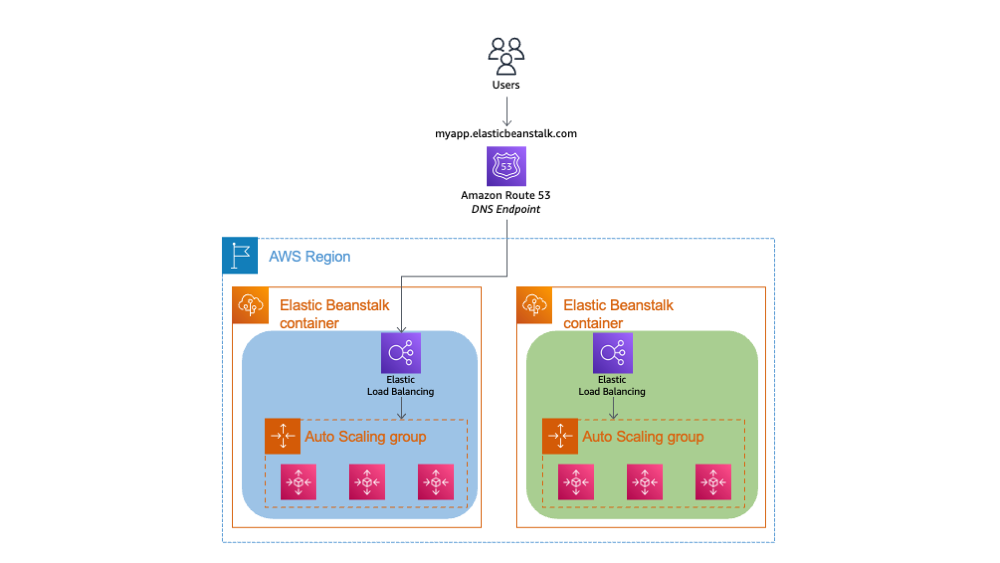

# Elastic Beanstalk

## Теория

Elastic Beanstalk - это сервис, который позволяет быстро подготовить инфраструктуру для веб-приложения. Сервис позволяет быстро вернуться к предыдущей версии, в случае если возникли проблемы с новой версией.

Сервис реализует подход *[blue-green deployment](https://wiki.merionet.ru/articles/sine-zelenoe-razvertyvanie-i-ego-rol-v-devops)*.

В сервисе Elastic Beanstalk поддерживаются основные промышленные языки программирования: Java, C#, PHP, Node.js, Python, Ruby, Go и Docker.

Elastic Beanstalk использует сервис AWS Cloudformation для быстрого развертывания инфраструктуры.

Развертывание новых версий веб-приложения в стиле *blue-green deployment*:
1. В начальном состоянии текущая версия веб-приложения работает в среде (environment) состоящей из нескольких взаимодействующих серверов. Обозначим её как Blue.
2. Для развертывания новой версии веб-приложения создается копия исходной среды. Обозначим её как Green.
3. Изменив DNS-резолвинг можно мгновенно переключить работу клиентов с Blue на Green и тем самым выполнив обновление версии приложения.



Чтобы пользователи не потеряли данные в работе приложений применяют одную из двух стратегий:
* обе версии кода веб-приложения работают с одной и той же СУБД;
* обе версии кода веб-приложения работают с разными копиями СУБД, которые связаны скриптами миграции.

## Практика

1. Войдите в веб-консоль AWS.
2. Откройте сервис Elastic Beanstalk в регионе Seoul (ap-northeast-2).
3. Создайте на локальном компьютере первую версию index.php (код прилагается ниже) и упакуйте его в ZIP-архив.
4. Создайте новое веб-приложение Beanstalk:

   **Шаг 1**:
   * *Environment tier*: Web server environment
   * *Application information*, Application name: `<группа>-<фамилия>`
   * *Environment information*, Environment name: `<группа>-<фамилия>-prod`
   * *Platform*, Platform: PHP
   * *Application code*: Upload your code
   * *Application code*, Version label: v1
   * *Application code*, Source code origin: Local file, выбрать ZIP-архив
   * *Presets*, Configuration presets: single Instance (free tier eligible)

   **Шаг 2**:
   * Service role: Use an existing service role
   * Existing service roles: выберите любую существующую роль
   * EC2 key pair: Не выбирать
   * EC2 instance profile: выберите любую существующую роль

   **Шаг 3**:
   * *Virtual Private Cloud (VPC)*, VPC: выбрать VPC
   * *Instance settings*, Public IP address: проставить Activated
   * *Instance subnets*: выберите все подсети
   * *Database subnets*: оставить не заполненным
   * *Enable database*: не включать

   **Шаг 4**
   * *Instances*, EC2 security groups: default

   **Шаг 5**
   * *Monitoring*, Health reporting, System: Basic
   * *Managed platform updates*, Managed updates: снять Activated

5. Дождитесь запуска окружения и скопируйте созданное доменное имя.
6. Войдите в сервис Route 53, в hosted-зону `kit-imi.info` и создайте CNAME-запись для доменного имени приложения.
5. Проверьте работу веб-приложения в браузере по созданному доменному имени и протоколу HTTP.
6. На локальном компьютере обновите код приложения и ZIP-архив.
7. Откройте созданное окружение (environment) и склонируйте новое окружение (Actions, Clone environment). Задайте название `<группа>-<фамилия>-staging` и выберите существующую роль.
8. Дождитесь запуска окружения и загрузите новую версию кода (Upload and deploy). Выберите новый zip-архив и укажите новую версию приложения.
9. Проверьте работу новой версии в staging-окружении открыв его доменное имя.
10. Обменяйте доменные имена окружений: Actions, Swap environment domain, выберите prod-окружение.
11. Проверьте работу новой версии приложения в браузере по созданному в Route 53 доменному имени.

Код приложения:

**index.php**:
```php
<!DOCTYPE html>
<html>
<body>
<h1>Hello World!</h1>
<p>Server time is <?php echo date("h:i:sa"); ?></p>
</body>
```

Измененный код приложения:

**index.php**:
```php
<!DOCTYPE html>
<html>
<body>
<h1>Добро пожаловать!</h1>
<p>Время на сервере <?php echo date("h:i:sa"); ?></p>
</body>
```

Ссылки: [https://aws.amazon.com/ru/elasticbeanstalk/](https://aws.amazon.com/ru/elasticbeanstalk/)
