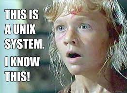

# Работа с файлами и каталогами

## Путь к файлу

Иерархическое дерево каталогов — структура файлов организованная с помощью файлов специального типа — каталогов. 

Каталог — это специальный файл, который хранит перечень имен файлов входящих в него.

Особые каталоги:

* (`/`) Корневой каталог — это единственный каталог который не входит ни в один другой каталог.
* (`~`) Домашний каталог пользователя — у каждого пользователя свой домашний каталог (у суперпользователя — `/root`, у остальных пользователей — как правило это подкаталог в `/home`).
* (`.`) Текущий рабочий каталог — у каждого процесса свой.
* (`..`) Родительский каталог — у каждого каталога свой.

Путь к файлу:

* Абсолютный путь — не зависит от контекста, начинается с символа `/` (`cd /`)
* Относительный путь — зависит от контекста
  - относительно домашнего каталога, начинается с символа `~` (`cd ~/../../etc`)
  - относительно текущего каталога, начинается с символа `.` (`cd ./etc`)
  - относительно родительского каталога, начинается с символа `..` (`cd ../../etc`)
  - неявный относительный путь — имя в текущем рабочем каталоге (`cd etc`)

Для перемещения по файловой системе используйте команды:

- `pwd` — показать текущий каталог (сокращение от `path to working directory`).
- `cd` — сменить текущий каталог (сокращение от `change directory`).
- `ls` — перечень файлов в каталоге (сокращение от `list files`).

Для лююбого файла система хранит:

* inode (внутренний идентификатор файла)
* имя
* дата создания
* дата модификации
* дата доступа
* права доступа
* владелец файла
* группа файла

## Файловые системы и дерево каталогов

Монтирование файловых систем — подключение файловых систем к дереву каталогов.

В Windows — для каждой файловой системы свое дерево каталогов и своя буква.

В Unix/Linux — дерево каталогов единое, файловые системы подключаются к нему.

Виртуальные файловые системы:

`/dev` — для взаимодействия с устройствами ввода-вывода
`/proc` — для взаимодействия с процессами (раньше также использовался для работы ядром)
`/sys` — для взаимодействия с ядром

`/proc/cpuinfo` — информация о процессоре
`/proc/meminfo` — информация об ОЗУ

## Типы файлов

Файл в Windows — это данные записанные на диск (на внешнюю память).

Файл в Unix/Linux — это средство для доступа к данным.

Файл в Linux может быть:

* частью файловой системы на диске
  - (-) обычный файл
  - (d) каталог
  - (l) символическая ссылка
* устройством ввода-вывода
  - (c) символьным устройством
  - (b) блочным устройством
* средством обмена данными
  - (p) именованные каналы
  - (s) сокеты

Ссылки:

* Символические ссылки. Символические ссылки могут стать невалидными, если целевой файл недоступен.
* Жесткие ссылки — дополнительное имя файла (`.` и `..` —- тоже жесткие ссылки). Жесткие ссылки работают только в пределах одной файловой системы.

## Filesystem Hierarchy Standard (FHS)

[Filesystem Hierarchy Standard](https://refspecs.linuxfoundation.org/FHS_3.0/fhs/index.html) — это стандарт на структуру каталогов в Linux

* `/bin` — программы
* `/sbin` — программы суперпользователя
* `/usr/bin` — программы пользователя
* `/usr/local/bin` — нестандартные программы пользователя
* `/opt` — программы из нестандартных источников
* `/srv` — серверные программы

* `/etc` — конфигурационные файлы
* `/home/<>` — домашний каталог пользователя
* `/root` — домашний каталог суперпользователя

* `/lib` — библиотеки
* `/usr/lib` — библиотеки пользовательких программ

* `/tmp` — временные файлы
* `/run` — каталог для временных файлов программ

* `/mnt` — точки монтирования дополнительных файловых систем
* `/media` — точки монтирования для съемных дисков

* `/dev`, `/proc`, `/sys` — виртуальные файловые системы

* `/var` — файлы с данными программ

## Терминал и оболочка

Терминал — это программа или устройство используемое для доступа пользователя с компьютеру по сети. В прошлом, когда компьютеры были большой редкостью, в ходу были компьютерные системы к которым подключались сразу несколько текстовых терминалов. Используя эти терминалы одновременно несколько человек могли работать одном компьютере с помощью интерфейса командной строки.

Сегодня терминал (точнее эмулятор терминала) — это программа для отображения интерфейса командной строки. Она отвечает за цвета, шрифты, передачу нажатий клавиш и т.п.

Оболочка (shell) — программа реализующая интерфейс командной строки. Она отвечает за интерпретацию команд, запуск других программ, 

Текущие оболочки:

* `sh` (устарела, но стандарт для скриптов)
* `bash` (оболочка по умолчанию)
* `fish` (удобная для начинающих)
* `zsh` (профессиональная)

Неактуальные оболочки: `csh`, `tcsh`, `ksh`

Типы аргументов командной строки:

* UNIX — аргументы вида `-h`, `-a`
* BSD — аргументы вида `a`, `x` (используются в редких случаях, в основном для совместимости со старыми приложениями)
* GNU — аргументы вида `--help`, `--all`

## Команды для работы с файлами

Операции с файлами:

* `touch` — обновление времени модификации файла / создание пустого файла
* `rm` — удаление (`-r`, `-f`)
* `cp` — копирование (`-r`)
* `mv` — перемещение / переименование (`-r`)
* `dd` — низкоуровневое копирование данные файлов (для файлов устройств)
* `file` — определяет тип файла
* `stat` — метаданные файла

Операции с каталогами:

* `pushd`, `popd` — переход в другой каталог и возврат обратно
* `mkdir` — создание каталогов
* `rmdir` — удаление пустых каталогов

Просмотр файлов:

* `head` — первые n строк файла (n=10)
* `tail` — последние n строк файла (n=10)
* `less` — программа просмотра текстовых файлов (`more` — старая программа просмотра файлов)

Поиск файлов:

* `find` — поиск файлов по критериями
* `which` — поиск программы в PATH
* `whereis` — поиск программы и относящихся к ней файлов
* `whatis` — информация что делает программа
* `man` — текстовая документация по программе
* `info` — текстовая документация по программе

Жесткие и символические ссылки:

* `ln` — создание жестких ссылок
* `ln -s` — создание символических ссылок
* `unlink` — удаление символических ссылок (также можно через `rm`)

Монтирование файловых систем:

* `mount` — подключение файловой системы к дереву каталогов
* `umount` — отключение файловой системы
* `chroot` — временная смена корневого каталога

## Полезные утилиты

* `mc` — файловый менеджер (напоминает Norton Commander)
* `ranger` — файловый менеджер (напоминает Finder)
* `vifm` — файловый менеджер с комбинациями клавиш из `vi`
* `nnn` — файловый менеджер
* `tree` — просмотр дерева каталогов
* `locate` — поиск файлов по имени в заранее созданной БД (`updatedb` — обновление БД с именами файлов)
