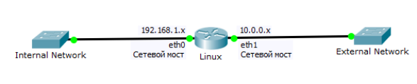

# Работа с IPTables

## Ход работы

Отключить DNS и DHCP-сервер

```
sudo systemctl stop bind9
sudo systemctl stop isc-dhcp-server
```

Включить веб-сервер.

Включить перенаправление (forward) для IPv4 пакетов командой:

```
sudo sysctl –w net.ipv4.ip_forward=1
```

Проверить перенаправление (forward) для IPv4 пакетов командой:

```
sysctl net.ipv4.ip_forward
```

или

```
cat /proc/sys/net/ipv4/ip_forward
```

Схема сети:



Виртуальная машина:
> `192.168.0.x` / `255.255.0.0` \
> `10.0.0.x` / `255.255.0.0`

Хост:
> `192.168.1.x` / `255.255.0.0` \
> `10.0.1.x` / `255.255.0.0`

где `X` – порядковый номер студента в классе.

## Закрыть порты

С помощью команды вида

```
iptables -A INPUT -i eth1 -p tcp --dport 80 -j DROP
```

## Поднять NAT

С помощью команды вида:

```
iptables -t nat -A POSTROUTING -o eth1 -j MASQUERADE
```

## Настроить Portmap

С помощью команды вида

```
iptables -t nat -A PREROUTING -i eth1 -p tcp --dport 8000 -j REDIRECT --to-port 80
```

## Настроить сохранение правил

Изменить настройку перенаправление (forward) для IPv4 пакетов в файле /etc/sysctl.conf:

```
net.ipv4.ip_forward = 1
```
